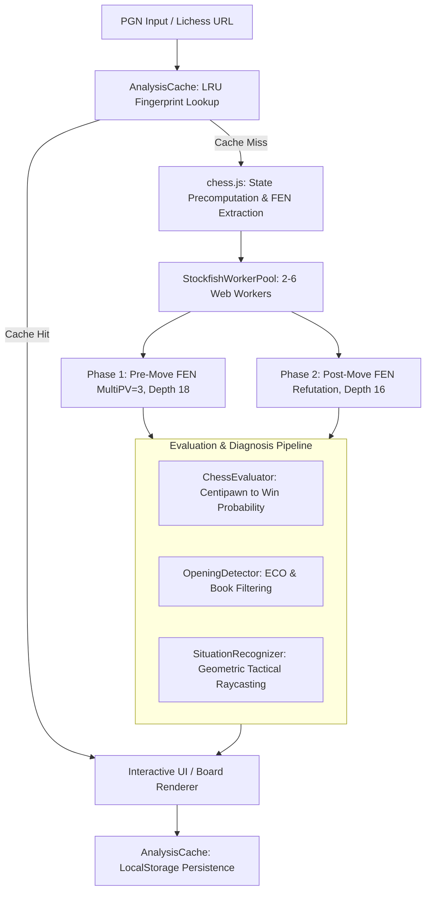

# WhyBlunder

WhyBlunder là một trình phân tích ván cờ chạy trong trình duyệt, không cần backend (máy chủ). Trình phân tích này chạy một cụm (pool) các worker engine Stockfish được biên dịch sang WebAssembly ngay trên máy của người dùng (client) để phân loại chất lượng nước đi, phát hiện các mẫu chiến thuật, và tạo ra lời giải thích dễ hiểu mà không cần hạ tầng máy chủ.

Các nền tảng phân tích cờ vua truyền thống thường gửi việc đánh giá ván cờ về hàng đợi (queue) trên máy chủ tập trung, gây ra độ trễ mạng, giới hạn tần suất (rate limit), chi phí vận hành hạ tầng và rào cản trả phí (subscription). WhyBlunder chuyển toàn bộ quy trình tính toán (đánh giá engine UCI, mô hình hóa xác suất thắng, nhận diện mẫu chiến thuật và phân tích cây biến thể) sang các Web Worker ở phía client.


---

## Kiến trúc & Luồng dữ liệu

WhyBlunder thực thi một quy trình (pipeline) phân tích bất đồng bộ phía client:



---

## Cơ chế cốt lõi

### 1. Cụm engine đa worker chạy song song (Parallel Engine Pool) (`js/browser-analyzer.js`)

WhyBlunder vượt qua nút thắt cổ chai đơn luồng của WebAssembly bằng cách chạy một cụm worker bất đồng bộ được cấu hình theo khả năng xử lý đồng thời của máy chủ (hardware concurrency):

```javascript
// Heuristic xác định kích thước cụm worker
const concurrency = navigator.hardwareConcurrency || 4;
const poolSize = Math.max(2, Math.min(concurrency >= 4 ? concurrency - 1 : concurrency, 6));
const pool = new StockfishWorkerPool(poolSize);
```

- **Cấp phát Hash & MultiPV**: Mỗi worker khởi tạo Stockfish với bảng băm (hash table) 32 MB (`setoption name Hash value 32`) và tìm kiếm 3 biến thể chính (principal variation) (`setoption name MultiPV value 3`).
- **Điều phối nước đi (ply) hai giai đoạn (Two-Phase)**:
  1. **Giai đoạn 1 (Trước nước đi)**: Điều phối FEN trước nước đi ở `depth 18` tới các worker đang rảnh. Nếu nước đi thực tế trùng với dòng (line) 1 của MultiPV, việc đánh giá hoàn tất.
  2. **Giai đoạn 2 (Phản bác sau nước đi)**: Nếu nước đi đã đánh là dưới tối ưu và không nằm trong các dòng 2–3 của MultiPV, WhyBlunder sẽ kích hoạt một lượt tìm kiếm có mục tiêu trên FEN sau nước đi ở `depth 16` để tính ra dòng phản bác (refutation line) chính xác của đối thủ.
- **Giới hạn an toàn (Safety Timeout)**: Các worker áp dụng giới hạn thực thi rõ ràng là 20 giây cho mỗi thế cờ để tránh tiến trình WASM bị treo ở các tàn cuộc phức tạp.

### 2. Xác suất thắng & Phân loại nước đi (`js/chess-evaluator.js`)

Điểm centipawn ($cp$) của engine được chuyển thành xác suất thắng ($WP \in [0.0, 1.0]$) bằng mô hình logistic chuẩn tâm tại 0:

$$WP = \frac{1}{1 + 10^{-cp / 400}}$$

Điểm chiếu hết (mate) được ánh xạ sang thang centipawn bị chặn: $cp = \text{sign}(m) \times (10000 - 10 \cdot |m|)$ với $m$ là số nước chiếu hết.

| Phân loại | Điều kiện / Mức giảm xác suất thắng ($\Delta WP$) | Cơ chế bảo vệ dự phòng |
| :--- | :--- | :--- |
| **Brilliant (Xuất sắc)** | Nước đã đi là hay nhất $\land$ Hy sinh thật sự $\land\ WP_{after} \ge 0.60 \land WP_{secondBest} \le 0.90 \land (WP_{after} - WP_{secondBest}) \ge 0.05$ | Không có |
| **Great / Best (Hay / Hay nhất)** | Nước đã đi là hay nhất $\land$ ($\text{isOnlyMove} \lor \Delta WP \le 0.01$) | Không có |
| **Book (Theo sách khai cuộc)** | Chuỗi nước đi khớp cơ sở dữ liệu ECO ($\le \text{ply } 16$) | Không có |
| **Inaccuracy (Thiếu chính xác)** | $0.04 \le \Delta WP < 0.10$ | Hạ cấp từ mistake khi chuyển hóa thế thắng ($WP > 0.90$) |
| **Mistake (Sai lầm)** | $0.10 \le \Delta WP < 0.22$ | Không có |
| **Blunder (Sai lầm nghiêm trọng)** | $\Delta WP \ge 0.22 \lor (\text{Bỏ lỡ chiến thắng: } WP_{before} \ge 0.85 \land WP_{after} < 0.55)$ | Ngăn blunder giả khi đơn giản hóa ở $WP \ge 0.95$ với $\Delta WP < 0.15$ |

### 3. Bộ nhận diện thế cờ chiến thuật (`js/situation-recognizer.js`)

Thay vì chỉ hiển thị kết quả engine thô, WhyBlunder áp dụng kỹ thuật dò tia (raycasting) trên 64 ô cờ và đồ thị tấn công để trích xuất các khái niệm cờ vua cụ thể:

- **Đòn đôi (Tactical Fork)**: Quét các đòn tấn công của quân cờ để phát hiện mối đe dọa đồng thời nhằm vào mục tiêu giá trị cao hơn hoặc không được bảo vệ; loại bỏ các quân tấn công có thể bị bắt lại qua `isPieceSafe()`.
- **Ghim & Xiên (Pin & Skewer)**: Lần theo các tia tấn công của quân trượt (Hậu, Xe, Tượng) xuyên qua mục tiêu trung gian tới Vua hoặc quân giá trị cao.
- **Quân treo (Hanging Piece)**: Nhận diện các quân không được bảo vệ di chuyển tới ô bị tấn công hoặc quân bảo vệ bị bỏ rơi.
- **Mẫu thế cờ (Positional Pattern)**: Phát hiện cặp tốt trung tâm (`d4`/`e4`), kiểm soát cột mở bằng Xe, xâm nhập hàng 7, đồn trú (outpost) thực sự và các thế mất quyền nhập thành.

```javascript
// Ví dụ schema đầu ra có cấu trúc từ SituationRecognizer
{
  flaw: "leaves the bishop hanging on e6, which allows dxe6 capturing the exposed piece",
  missedChance: "missed winning the enemy Queen with Rxd4",
  betterLine: "Bc4 was much better because it maintains the active diagonal",
  tags: ["Hanging Piece", "Tactical Fork", "Center Control"]
}
```

### 4. Bộ nhớ đệm LRU phía client (`js/analysis-cache.js`)

Kết quả phân tích được lưu trong `localStorage` dưới khóa `whyblunder_analysis_cache_v1`:

- **Chuẩn hóa dấu vân tay (Fingerprint Normalization)**: Loại bỏ header, bình luận PGN (`{}`), biến thể (`()`), NAG (`$N`) và dấu thời gian (clock) trước khi tạo khóa băm cơ số 36 (base-36).
- **Loại bỏ LRU (LRU Eviction)**: Giới hạn lưu trữ tối đa 5 ván phân tích đầy đủ. Khi vượt hạn mức (quota), bộ nhớ đệm sẽ tự động cắt bớt 50% mục cũ nhất.
- **Phân giải URL / ID Lichess**: Truy xuất trực tiếp đánh giá đã lưu cho các ID ván cờ (ví dụ: `https://lichess.org/Qa7FJNk2`).

---

## Đánh đổi trong kiến trúc

| Lựa chọn thiết kế | Cách tiếp cận đã chọn | Cách tiếp cận thay thế | Đánh đổi kỹ thuật |
| :--- | :--- | :--- | :--- |
| **Thực thi engine** | Web Worker WebAssembly trong trình duyệt | Cụm máy chủ backend (ví dụ: Celery + Stockfish binary) | Loại bỏ toàn bộ chi phí hạ tầng máy chủ và nút thắt mở rộng; tăng mức tiêu thụ CPU và pin của client trong lúc phân tích. |
| **Lập lịch ply** | Điều phối đồng thời, không theo thứ tự qua cụm worker | Tìm kiếm tuần tự theo trình tự thời gian | Tăng tốc phân tích cả ván (10–15 giây cho 60 ply trên 8 nhân); không thể chia sẻ bảng chuyển vị (transposition table, TT) giữa các ply liên tiếp trên các worker. |
| **Cấp phát bộ nhớ** | Bảng băm tĩnh 32 MB cho mỗi worker | Một bảng chuyển vị lớn dùng chung duy nhất | Tránh yêu cầu cô lập cross-origin và triển khai `SharedArrayBuffer`; giới hạn tỷ lệ trúng bảng (table hit rate) ở tàn cuộc sâu trên thiết bị cấu hình thấp. |

---

## Phát triển & Kiểm thử trên máy cá nhân

WhyBlunder không yêu cầu bước build hay trình đóng gói (bundler). Mọi module đều dùng lớp bọc UMD tương thích với script trình duyệt gốc và Node.js.

### 1. Chạy trên máy cá nhân

Phục vụ thư mục gốc của kho mã nguồn bằng bất kỳ máy chủ tệp tĩnh nào:

```bash
# Python 3
python3 -m http.server 3030

# Node.js
npx serve .
```

Mở `http://localhost:3030` trong trình duyệt hỗ trợ WebAssembly và Web Worker.

### 2. Chạy bộ kiểm thử

Kiểm chứng công thức đánh giá, nhận diện khai cuộc, chênh lệch liệu (material) và bộ phát hiện chiến thuật trong Node.js:

```bash
node test_browser_modules.js
```

---

## Ràng buộc & Hạn chế

- **Cô lập bảng chuyển vị (Transposition Table)**: Vì các Web Worker hoạt động trong vùng nhớ biệt lập không có bộ nhớ dùng chung, các thế cờ trùng lặp giữa các biến thể được mỗi worker đánh giá độc lập.
- **Trần đồng thời phần cứng (Hardware Concurrency)**: Hệ thống có ít hơn 4 luồng sẽ dùng dự phòng 2 worker để duy trì độ phản hồi của giao diện, kéo dài thời gian phân tích trên thiết bị di động giá rẻ.
- **Dự phòng WASM**: Môi trường thiếu WebAssembly sẽ kiểm chứng dựa trên `js/stockfish.js` (asm.js), khiến thông lượng tìm kiếm giảm khoảng 3 lần.
- **Giới hạn chiều sâu (Depth)**: Phân tích mặc định cố định ở độ sâu 18 cho đánh giá trước nước đi và độ sâu 16 cho các dòng phản bác, nhằm cân bằng giữa chiều sâu chiến thuật và thời gian chạy trên client.
